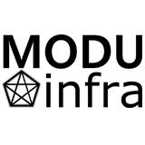

#  모두인프라 (MODUinfra)

---

## 💡 혁신적인 기술과 함께 성장하는 기업

모두인프라는 전자상거래, 온라인 마케팅, 그리고 **바이브코딩(Vibe Coding)**을 통한 혁신적인 수익 모델을 창출합니다.

### 주요 사업 영역
| 사업부문 | 주요내용 |
| :--- | :--- |
| **전자상거래** | 효율적인 커머스 솔루션 운영 |
| **온라인 마케팅** | 데이터 기반 마케팅 및 브랜드 가치 제고 |
| **바이브코딩** | 빠르게 가치를 창출하는 비즈니스 개발 |

---

## 📍 찾아오시는 길
- **주소:** 서울특별시 관악구 국회단지7길 10
- **문의:** [moduinfra@gmail.com](mailto:moduinfra@gmail.com)
